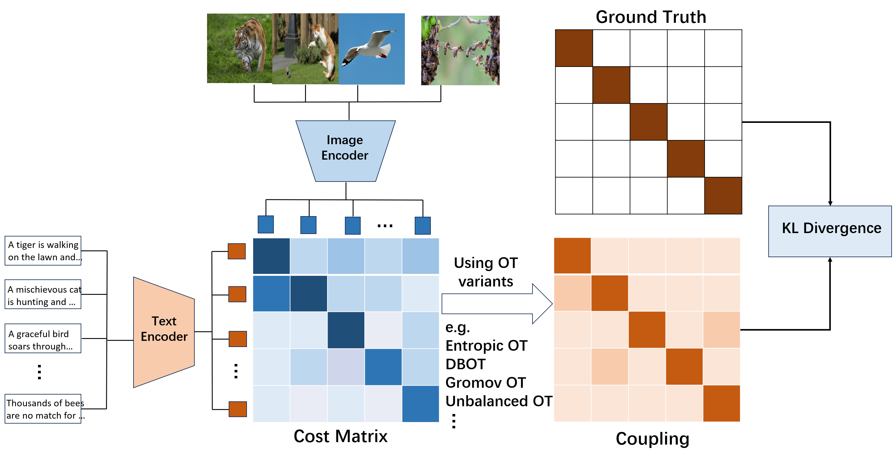
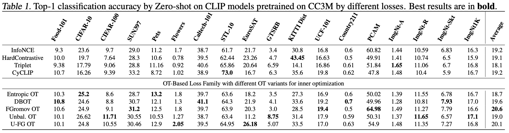

# ICML2024-OT-CLIP

Official Repository for ICML'24 "OT-CLIP: Understanding and Generalizing CLIP via Optimal Transport". [[paper](URL)]

## OT-CLIP Overview

## Training

In `training/loss.py`, we provide our OT losses as stand-alone modules that can be used flexibly with image-text pre-training procedures. The provided implementations were made to fit the [open_clip](URL) repository for training CLIP models. Simply replace any of the loss modules with the default cross entropy loss in the CLIP implementation to use the OT loss.

## Inference

In `inference/loss.py`, we provide simple optimization functions that can be applied during inference time with minimal additional computation. To replicate the results in the paper, you can apply these optimizations post-inference using [OpenAI's pre-trained CLIP](https://github.com/openai/CLIP).

We used evaluation procedures from the following repos:

Zero-shot/ Graph-matching experiments: https://github.com/facebookresearch/SLIP.

Long-tailed experiments: https://github.com/shijxcs/PEL.

## Acknowledgements

https://github.com/mlfoundations/open_clip

https://github.com/facebookresearch/SLIP

https://github.com/facebookresearch/vissl/tree/main

https://github.com/shijxcs/PEL

https://github.com/openai/CLIP

https://github.com/CaoWGG/CenterNet-CondInst

https://github.com/princeton-nlp/SimCSE
